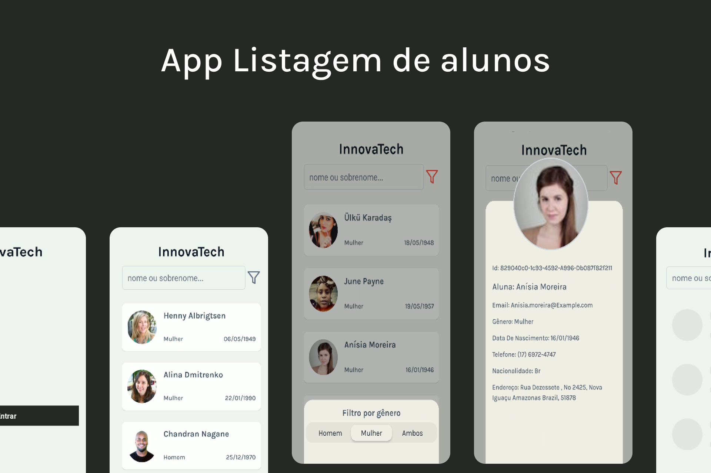

<h1 align="center">Projeto - Lista de estudantes</h1>

<p align="center">
  

  

  
  
  <a href="https://github.com/williamjayjay/Github-Blog/commits/master">
    
  </a>
    
   <a href="https://github.com/williamjayjay/innovatec-mobile-rework/stargazers">
    
  </a>
</p>

<p align="center"><p align="center">
Este aplicativo tem como principais funcionalidades a busca de dados de estudantes a partir de uma API externa, o armazenamento dessas informações no storage, a exibição em uma lista com scroll infinito, a apresentação dos detalhes de cada aluno em um modal dinâmico, e a possibilidade de alterar o gênero do estudante em um modal separado.</p>

<p align="center">

</p>

## 🥶 Sobre o projeto

Desenvolvi esse projeto para uma das etapas do teste para a C2S.

## Mobile React Native:

**Aplicativo:** O app irá buscar e exibir dados de pessoas ao redor do mundo, mas classificaremos como alunos.

## 🚀 Tecnologias

Principais tecnologias que utilizei para desenvolver esta aplicação

- [Typescript](https://www.typescriptlang.org/)
- [Async-Storage](https://docs.expo.dev/versions/latest/sdk/async-storage/)
- [React-Navigation](https://reactnavigation.org/)
- [Expo-Font](https://docs.expo.dev/versions/latest/sdk/font/)
- [NativeWind](https://www.nativewind.dev/quick-starts/expo)
- [TailwindCSS](https://www.nativewind.dev/)
- [Zod](https://zod.dev/)
- [Axios](https://axios-http.com/docs/intro)
- [React-Native-Toast-Message](https://www.npmjs.com/package/react-native-toast-message)
- [React-Native-SVG](https://docs.expo.dev/versions/latest/sdk/svg/)
- [Tanstack Query](https://tanstack.com/query/latest/docs/framework/react/overview)
- [Classnames](https://www.npmjs.com/package/classnames)
- [Date FNS](https://date-fns.org/docs/Getting-Started)
- [React-Native-Reanimated](https://docs.swmansion.com/react-native-reanimated/)
- [React Content Loader](https://github.com/danilowoz/react-content-loader)
- [React-Native-Safe-Area-Context](https://docs.expo.dev/versions/latest/sdk/safe-area-context/)
- [FakerJS](https://fakerjs.dev/)
- [Testing Library React Hooks](https://react-hooks-testing-library.com/installation)
- [Jest Native](https://testing-library.com/docs/ecosystem-jest-native/)
- [Jest Expo]()
- [Jest]()
- [Jest Fech Mock]()
- [Testing Library Jest Native]()

## Detalhe CI CD

No arquivo ci_cd.yml observe o alias para a criar a secret no github que irá conter o token expo para assim podermos criar um fluxo de automação CI CD que irá executar o build da aplicação, rodar os testes unitários e por fim gerar o apk do aplicativo android no caso. 

## Testes unitários

Para rodar os testes basta iniciar o comando:
  ```sh
  bun run test
  ```

## Guia de inicialização

Para instalar e configurar uma cópia local, siga estas etapas simples:

### Prerequisitos

Para garantir o funcionamento adequado da nossa aplicação, verifique abaixo:

1. **Clone o repositório**:
  ```sh
  git clone https://github.com/williamjayjay/innovatec-mobile-rework
  ```

2. **Navegue na raiz do projeto innovatec-mobile-rework:**

3. **Instale os módulos:**
  ```sh
  bun i
  ```

4. **Copie o .env de exemplo:** 

5. **Rode o aplicativo:**
  ```sh
  bun android
  ```

## Roadmap

- [x] Iniciar o aplicativo, entrar na tela de login

- [x] Na tela de login conseguir navegar para a tela home via tela de login

- [x] Caso não haja alunos no storage, deve buscar dados da API.

- [x] Caso haja alunos no storage, deve exibir esses últimos 10 dados e não buscar nada na API ainda.

- [x] Conseguir fazer "push refresh" ao puxar para baixo a lista e assim conseguir atualizar os alunos que estão sendo buscados da API.

- [x] Conseguir buscar mais alunos atráves do "scroll infinity" na flatlist.

- [x] Conseguir visualizar mais informações do aluno ao clicar no componente do mesmo.

- [x] Conseguir alterar o filtro de alunos por gênero.

- [x] Conseguir buscar alunos pelo filtro de pesquisa.

<!-- --------------------- -->
## UI UX
UI e UX feita pelo time innovatec.

| Tela de login | Tela Home |
|:-------------------------:|:-------------------------:|
|  |  |

| Modal de filtros | Barra de Pesquisa |
|:-------------------------:|:-------------------------:|
|  |  |

| Shimmer Effect | Modal de perfil |
|:-------------------------:|:-------------------------:|
|  |  |

| Scroll Infinity |
|:-------------------------:|
|  |
